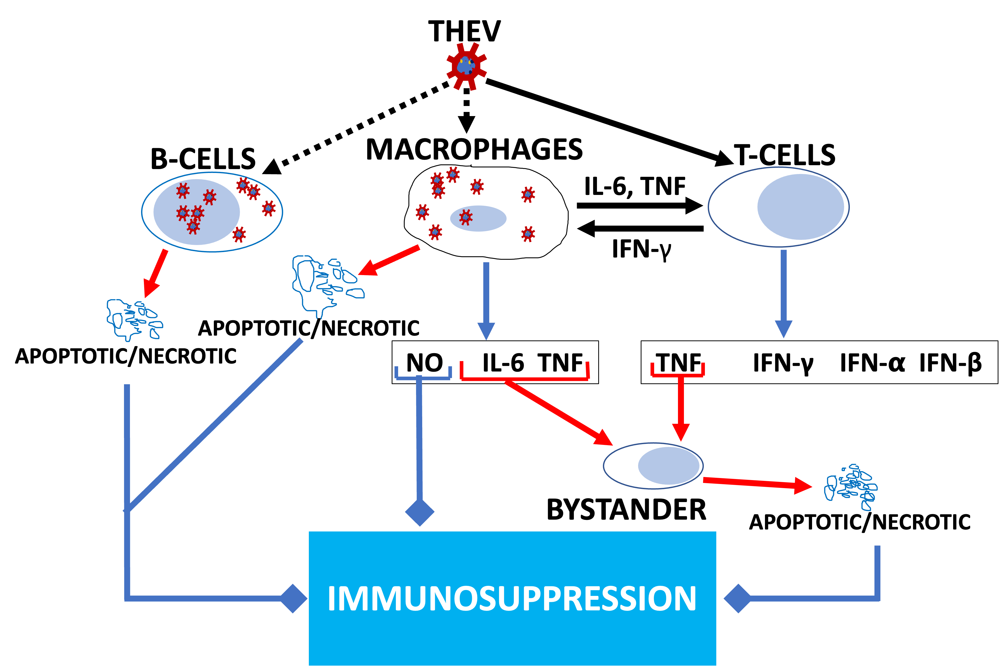

\vspace{5mm}

Abraham Quaye${^\dagger}$^,a^, Brian D. Poole^a,\*^

\vspace{5mm}
  
^a^Department of Microbiology and Molecular Biology, Brigham Young University\
${^\dagger}$First-author\
^\*^Corresponding Author

\vspace{5mm}

**Corresponding Author Information**\
[brian_poole\@byu.edu](mailto:brian_poole@byu.edu)\
Department of Microbiology and Molecular Biology,\
4007 Life Sciences Building (LSB),\
Brigham Young University,\
Provo, Utah\

\newpage
  
```{r setup, echo=FALSE,include=FALSE, message=FALSE, warning=FALSE}
library(knitr)
library(flextable)
opts_chunk$set(echo = FALSE, message = FALSE, warning = FALSE)
```

## ABSTRACT
\newpage
## INTRODUCTION

Turkey hemorrhagic enteritis virus (THEV), belonging to the family _Adenoviridae_, genus _Siadenovirus_, infects turkeys, chickens, and pheasants [@Harrach2008; @Davison2003]. Infecting its hosts via the feco-oral route, THEV causes hemorrhagic enteritis (HE) in turkeys, a debilitating disease affecting predominantly 6-12 week old turkey poults characterized by immunosuppression (IMS), depression, splenomegaly, intestinal lesions leading to bloody droppings, and up to 80% mortality [@Gross1967; @Beach2006; @Dhama2017; @Tykaowski2019]. The clinical disease usually persists in affected flocks for about 7-10 days. However, secondary bacterial infections may extend the duration of illness and mortality for an additional 2-3 weeks due to the immunosuppressive nature of the virus, exacerbating the economic losses [@Pierson2008; @Dhama2017]. Low pathogenic (avirulent) strains of THEV have been isolated, which show subclinical infections but retain the immunosuppressive effects. Since its isolation from a pheasant spleen, the Virginia Avirulent Strain (VAS) has been used effectively as a live vaccine despite the immunosuppressive side-effects but the vaccinated birds are rendered more susceptible to opportunistic infections and death than unvaccinated cohorts leading to significant economic losses [@Beach2006; @Rautenschlein2000; @Larsen1985; @Dhama2017; @Beach2009a]. 

It is well-established that THEV primarily infects and replicates in turkey B-cells of the bursa and spleen and somewhat in macrophages, inducing apoptosis and necrosis. Consequently, a significant drop in number of B-cells (specifically, IgM+ B-cells) and macrophages ensue along with increased T-cell counts with abnormal T-cell subpopulation (CD4+ and CD8+) ratios. The cell death seen in the B-cells and macrophages is generally proposed as the major cause of THEV-induced IMS as both humoral and cell-mediated immunity are impaired [@Tykaowski2019; @Rautenschlein2000; @Dhama2017; @Rautenschlein2000b]. It is also thought that the virus replication in the spleen attracts T-cells and peripheral blood macrophages to the spleen where the T-cells are activated by cytokines from activated macrophages and vice versa. The activated T-cells undergo clonal expansion and secrete interferons: type I (IFN-\(\alpha\) and IFN-\(\beta\)) and type II (IFN-\(\gamma\)) as well as tumor necrosis factor (TNF) while activated macrophages secrete interleukin 6 (IL-6), TNF, and nitric oxide (NO), an antiviral agent with immunosuppressive properties. The inflammatory cytokines released by T-cells and macrophages (e.g., TNF and IL-6) may also induce apoptosis in bystander splenocytes, exacerbating the already numerous apoptotic and necrotic splenocytes, culminating in IMS [@Rautenschlein2000; @Rautenschlein2000b] (see **Figure 1**). However, the precise molecular mechanisms of THEV-induced IMS or pathways involved are poorly understood [@Tykaowski2019]. Elucidating the specific mechanisms and pathways of THEV-induced IMS is the most crucial step in THEV research as it will present a means of mitigating the IMS.

Next generation sequencing (NGS) is a groundbreaking technology that has significantly enhanced our understanding of DNA and RNA structure and function, and facilitated exceptional advancements in all domains of biology and the Life Sciences, including rare genetic diseases, cancer genomics, microbiome analysis, infectious diseases, and population genetics [@Satam2023]. mRNA sequencing (RNA-seq), an NGS approach to transcriptomic studies, is a versatile, high throughput, and cost-effective technology that allows a broad scan of the entire transcriptome (the complete set of RNA molecules produced under specific conditions or in specific cells), thereby uncovering the active molecular pathways and processes. This technology has been leveraged in uncountable number of studies to elucidate cellular mechanisms under a wide range of treatment conditions, including virus-infected versus uninfected transcriptome comparisons [@Pandey2023; @Wang2019; @Choi2016; @Satam2023; @Mo2023]. In RNA-seq studies, differentially expressed genes (DEGs) identified under different experimental conditions are key to unlocking the interesting biology or mechanism under study.

To the best of our knowledge, no studies have been done leveraging the wealth of information offered by RNA-seq to elucidate the molecular mechanisms and pathways leading to THEV-induced IMS. To effectively counteract the immunosupressive effect of the vaccine, it is essential to unravel the host mechanisms/pathways influenced by the virus to bring about IMS. In this work, we present the first transcriptome profile analysis of THEV-infected turkey MDTC-RP19 B-cells by paired-end RNA-seq, highlighting specific host cellular/molecular processes affected during a THEV infection. Our paired-end sequencing allowed for reading 149 bp long high quality (mean Phred Score of 36) sequences from each end of cDNA fragments, which were mapped to the genome of domestic turkey (*Meleagris gallopavo*).
***put overview of results here
\newpage

## RESULTS
\newpage

## DISCUSSION
\newpage

## CONCLUSIONS
\newpage

## MATERIALS AND METHODS

**Cell culture and THEV Infection**   
The Turkey B-cell line (MDTC-RP19, ATCC CRL-8135) was grown as suspension cultures in 1:1 complete Leibovitz's L-15/McCoy's 5A medium with 10% fetal bovine serum (FBS), 20% chicken serum (ChS), 5% tryptose phosphate broth (TPB), and 1% antibiotic solution (100 U/mL Penicillin and 100$\mu g$/mL Streptomycin), at 41^o^C in a humidified atmosphere with 5% CO~2~. Infected cells were maintained in 1:1 serum-reduced Leibovitz's L15/McCoy's 5A media (SRLM) with 2.5% FBS, 5% ChS, 1.2% TPB, and 1% antibiotic solution. A commercially available THEV vaccine was purchased from Hygieia Biological Labs (VAS strain). The stock virus was titrated using an in-house qPCR assay with titer expressed as genome copy number (GCN)/mL, similar to Mahshoub *et al* [@Mahsoub2017] with modifications. Cells were infected in triplicate at a multiplicity of infection (MOI) of 100 GCN/cell, incubated at 41^o^C for 1 hour, and washed three times with phosphate buffered saline (PBS) to get rid of free virus particles. Triplicate samples were harvested at 4-, 12-, 24-, and 72-hpi for total RNA extraction.

**RNA extraction and Sequencing**   
Total RNA was extracted from infected cells using the Thermofisher RNAqueous™-4PCR Total RNA Isolation Kit (which includes a DNase I digestion step) per manufacturer's instructions. An agarose gel electrophoresis was performed to check RNA integrity. The RNA quantity and purity was initially assessed using nanodrop, and RNA was used only if the A260/A280 ratio was 2.0 ± 0.05 and the A260/A230 ratio was \>2 and \<2.2. Extracted total RNA samples were sent to LC Sciences, Houston TX for poly-A-tailed mRNA sequencing where RNA integrity was checked with Agilent Technologies 2100 Bioanalyzer High Sensitivity DNA Chip and poly(A) RNA-seq library was prepared following Illumina's TruSeq-stranded-mRNA sample preparation protocol. Paired-end sequencing to generate 150 bp reads was performed on the Illumina NovaSeq 6000 sequencing system.

**Quality Control and Mapping Process**

**Functional Enrichment Analysis**

**Expression Profiling and Differentially Expressed Genes**

**Quantitative Real-Time Reverse Transcriptase PCR**

**Statistical Analysis**
\newpage

## DATA AVAILABILITY
\newpage

## CODE AVAILABILITY
\newpage

## ACKNOWLEDGMENTS
\newpage

## REFERENCES

```{=tex}
\setlength{\parindent}{-0.25in}
\setlength{\leftskip}{0.25in}
```
\noindent

::: {#refs}
:::

```{=tex}
\setlength{\parindent}{0in}
\setlength{\leftskip}{0in}
\newpage
```
\newpage

## TABLES AND FIGURES

**Figure 1: Model of THEV-induced immunosuppression in turkeys**. THEV infection of target cells is indicated with black dotted arrows. Black unbroken arrows indicate cell activation. Red arrows indicated signals leading to apoptosis. Blue arrows indicate all cytokines released by the cell. Blue arrows with square heads indicated an event leading to IMS. Adapted from ([@Rautenschlein2000])
\newpage

## SUPPLEMENTARY INFORMATION/MATERIALS
